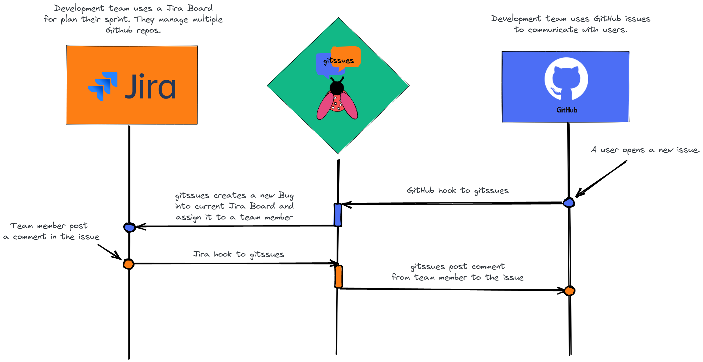

# gitssues

Jira and Github sync issues

## Detailed Jira Flow

- [docs](docs/README.md)

# TODO

- [ ] Create Webhook for Jira when comment on an issue
- [ ] Create Webhook for Jira when issue is updated
- [ ] Create Webhook for Jira when transition is applied to an issue
- [ ] Create GitHub integration
- [ ] Create GitHub Webhook
- [ ] Create Server endpoints for Jira and GitHub

### Jira Docs

- [Jira Cloud platform Developer
](https://developer.atlassian.com/cloud/jira/platform/rest/v3/api-group-issues/)
- [Jira Software Cloud Developer
](https://developer.atlassian.com/cloud/jira/software/rest/intro/)
